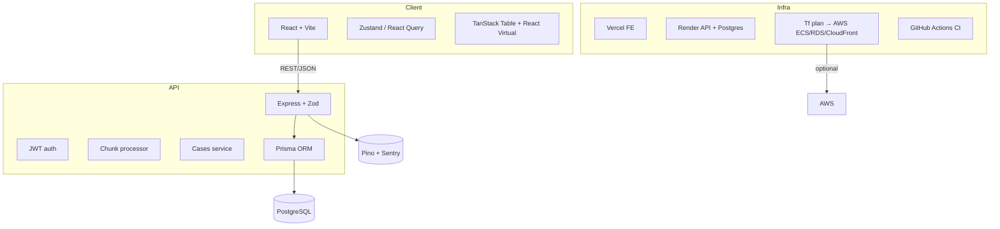

# CaseFlow

“Import → Validate → Fix → Submit → Track” — a production-ready CSV ingestion workflow that lets ops teams upload 50k-row spreadsheets, clean inline, and create cases reliably.

## Live demo

| Surface | URL | Notes |
|---------|-----|-------|
| Frontend | https://caseflow-frontend.vercel.app | Vite build on Vercel with SPA rewrites. |
| Backend | https://caseflow-d3j5.onrender.com/api | Express API on Render (health at `/api/health`). |
| Postman/OpenAPI | `app/backend/openapi.yml` | Import for full REST coverage. |
| Demo CSVs | `data/sample-clean.csv`, `data/sample-errors.csv` | Clean vs. intentionally broken rows used in the video walkthrough. |

## Architecture overview



- **Frontend**: React 18 + TypeScript + Vite, Zustand for domain state (auth/import workspace), React Query for server cache, TanStack Table + React Virtual for the editable grid, Playwright for E2E, i18n via `react-i18next`.
- **Backend**: Express + TypeScript + Zod validations, Prisma/PostgreSQL, modules for auth/imports/cases/users/health, audit trail + case history, chunk processor with retries.
- **Infra**: Docker for local dev, Vercel + Render for the hosted demo, GitHub Actions for CI, optional Terraform stack (`infra/terraform`) that provisions AWS VPC + ECS Fargate + RDS + CloudFront/S3 for production.

## Local development (one command)

1. **Prereqs**: Node 20+, npm 10+, Docker Desktop.
2. **One-command spin-up**  
   ```bash
   docker compose up --build
   ```
   - Frontend → http://localhost:5173  
   - Backend → http://localhost:4000/api  
   - Postgres → localhost:55432 (`caseflow` / `caseflow`) — seeds an admin automatically via `npm run seed:admin`.
3. **Manual hot reload (optional)**  
   ```bash
   npm install
   npm run dev --workspace app/backend &
   npm run dev --workspace app/frontend
   ```

## Design decisions & tradeoffs

- **Headless grid**: TanStack Table + React Virtual keeps the bundle lean and lets us own accessibility/keyboard bindings. Avoided heavier AG Grid to keep DX nimble.
- **Zustand slices**: Auth + import workspace run inside independent stores to prevent cross-feature rerenders, while React Query handles server data (cases, import history).
- **Schema mapping UX**: Auto-detect column hints but always let operators override, with missing-required warnings so you can’t submit half-mapped CSVs.
- **Shared validation**: Zod schemas mirrored front/back ensure instant inline errors but let the backend stay the source of truth.
- **Chunked ingestion**: Client submits normalized rows in batches (default 500) with optimistic progress, retry/backoff, and upload cancellation. Backend transactions dedupe case IDs per chunk and across file.
- **Fix helpers & bulk edits**: Fix-all actions (trim/title-case/normalize) and selection-aware bulk updates reduce toil for 50k-row files.
- **Feature flags**: `featureFlags` module toggles advanced grid toolbar + offline queue so we can Gradually Roll Out more complex UX without branching the codebase.

## Performance notes

- **Virtualized grid**: Only ~30 DOM rows render at a time, so even 50k-row uploads stay <60 FPS.
- **Worker-backed parsing**: PapaParse runs inside a web worker (`useCsvParser`) so CSV parsing + validation doesn’t block the main thread.
- **Batched UI updates**: Fix-all helpers and validators batch row mutations to avoid React thrash; Zustand selectors keep writes scoped.
- **Backend throughput**: Prisma upserts run inside chunk transactions; dedupe + audit writes happen in the same pass. Cursor pagination + indexed filters keep `/cases` queries O(pageSize).

## Security notes

- **Auth**: Email/password with bcrypt hashing, short-lived access tokens, refresh tokens stored in DB (revocation supported). Role-based guards separate Admin vs. Operator routes.
- **Transport**: HTTPS enforced by Vercel/Render/CloudFront; CORS locked via `ALLOWED_ORIGINS`.
- **Validation + sanitization**: Zod schemas enforce types, enums, ISO dates, and email/phone formats on every API boundary. Client mirrors them to avoid inconsistent state.
- **Secrets**: `.env` never committed; Docker/Render/Terraform expect environment variables or secret stores. JWT secrets configurable per env.
- **OWASP basics**: Helmet, compression, input size caps, centralized error handler that hides stack traces, and rate-limited auth endpoints (handled at platform/CDN edge).

## Testing strategy & coverage

| Layer | Tooling | Highlights |
|-------|---------|------------|
| Frontend unit/component | Vitest + Testing Library | Schema mapping, fix helpers, import store, bulk edit panel, upload queue persistence. |
| Frontend E2E | Playwright (`app/frontend/e2e`) | Smoke journey: mocked login → upload sample CSV → validate → submit with chunk mocks. |
| Backend unit/integration | Vitest + Prisma mocks | Imports service (chunk dedupe, audit trail) + cases service (cursor pagination, transactional updates + notes). |
| Type safety | `npm run typecheck` | Strict TS across front/back (tsconfig extends from repo root). |
| CI | GitHub Actions (`.github/workflows/ci.yml`) | Lint + typecheck + tests + build with Postgres service to mirror prod schema. |

Run locally:

```bash
npm run lint           # eslint across workspaces
npm run typecheck      # tsc --noEmit for frontend + backend
npm run test           # Vitest suites (front + back)
npm run e2e --workspace app/frontend  # Playwright (optional)
```

## Deployment instructions & env vars

### Docker Compose (local parity)

`docker compose up --build` spins Postgres + API + Vite build for smoke testing.

### Vercel (frontend) + Render (backend) — current demo

1. **Postgres**: Provision Render Postgres (or Supabase). Run migrations with `DATABASE_URL="postgres://..." npx prisma migrate deploy`.
2. **Backend Web Service** (`app/backend`):
   - Build: `npm install --include=dev && npx prisma generate && npm run build`
   - Start: `npx prisma migrate deploy && npm run seed:admin && node dist/index.js`
   - Env vars:  
     `DATABASE_URL`, `JWT_ACCESS_SECRET`, `JWT_REFRESH_SECRET`, `ACCESS_TOKEN_TTL=15m`, `REFRESH_TOKEN_TTL=7d`, `ALLOWED_ORIGINS=https://<frontend>,http://localhost:5173`, optional `SENTRY_DSN`.
3. **Frontend** (Vercel, root `app/frontend`):
   - Env vars: `VITE_API_URL=https://<render-service>.onrender.com/api`, optional `VITE_ENABLE_ADVANCED_GRID_TOOLBAR=true`, `VITE_ENABLE_OFFLINE_UPLOAD_QUEUE=false`.
   - Build: `npm run build`, Output: `dist`.
4. **Smoke test**: Sign in with seeded admin, upload `data/sample-errors.csv`, run Fix Helpers, submit, view cases list + detail page.

### AWS Terraform (bonus IaC)

`infra/terraform` provisions VPC + ECS Fargate + RDS Postgres + ALB + CloudFront/S3:

```bash
cd infra/terraform
cp terraform.tfvars.example terraform.tfvars   # fill in secrets/image URL
terraform init
terraform apply
```

Variables to set:

| Variable | Description |
|----------|-------------|
| `project_name` / `environment` | Used for tagging + naming (e.g., `caseflow` / `prod`). |
| `backend_image` | ECR image for `app/backend` build (push via `docker buildx`). |
| `db_username` / `db_password` | Postgres credentials (used in generated `DATABASE_URL`). |
| `jwt_access_secret` / `jwt_refresh_secret` | Secrets shared with the API. |
| `allowed_origins` | Comma-separated frontend origins (CloudFront + localhost). |
| `frontend_bucket_name` | Optional S3 bucket name (lowercase). |

Outputs include:

- `alb_dns_name` / `api_url` — point `VITE_API_URL` here.
- `cloudfront_domain_name` — hosts the uploaded Vite build (`npm run build && aws s3 sync dist s3://<bucket>`).
- `database_endpoint` — for migrations/seeding via `DATABASE_URL`.

Destroy with `terraform destroy` when done.

### Environment variables summary

| Key | Surface | Purpose |
|-----|---------|---------|
| `DATABASE_URL` | Backend | Prisma/Postgres connection. |
| `JWT_ACCESS_SECRET`, `JWT_REFRESH_SECRET` | Backend | Token signing. |
| `ACCESS_TOKEN_TTL`, `REFRESH_TOKEN_TTL` | Backend | Token expiry (supports `ms` syntax). |
| `ALLOWED_ORIGINS` | Backend | CSV of allowed origins for CORS. |
| `SENTRY_DSN` | Backend | Optional error tracking. |
| `VITE_API_URL` | Frontend | Base API URL (defaults to `/api` for proxy/dev). |
| `VITE_ENABLE_ADVANCED_GRID_TOOLBAR`, `VITE_ENABLE_OFFLINE_UPLOAD_QUEUE` | Frontend | Feature flags for advanced tools/offline upload queue. |

## Observability & operations

- **Logging**: Pino structured logs with morgan access logs; optional Sentry DSN captures exceptions (Express middleware).
- **Health**: `/api/health` hits Prisma via raw query and returns status/time.
- **Audit trail**: `caseImport`, `caseImportChunk`, `importAudit`, `caseHistory`, and `caseNote` tables track who imported what, chunk stats, and downstream case updates.
- **CI/CD**: GitHub Actions pipeline runs lint → typecheck → vitest → build with a Postgres service to catch migration errors before merge.

## Supporting assets & deliverables

- **OpenAPI spec**: `app/backend/openapi.yml` (importable to Postman/Insomnia).
- **Sample CSVs**: `data/sample-clean.csv` (happy path) + `data/sample-errors.csv` (bad email, non-E.164 phone, missing priority).
- **Demo video**: Walkthrough referenced in submission email (see instructions).
- **Tests**: `npm run test` plus Playwright smoke spec under `app/frontend/e2e`.
- **Terraform**: `infra/terraform` folder with README + `terraform.tfvars.example` for AWS deployment.

## Submission

Email **hiring@skycladventures.com** with subject **“CaseFlow – Senior Full-Stack Assignment”** and include:

1. GitHub repository link.
2. Live frontend + backend URLs.
3. 5–7 minute demo video link.
4. Optional: Terraform outputs/notes if deploying to AWS via the provided IaC.
