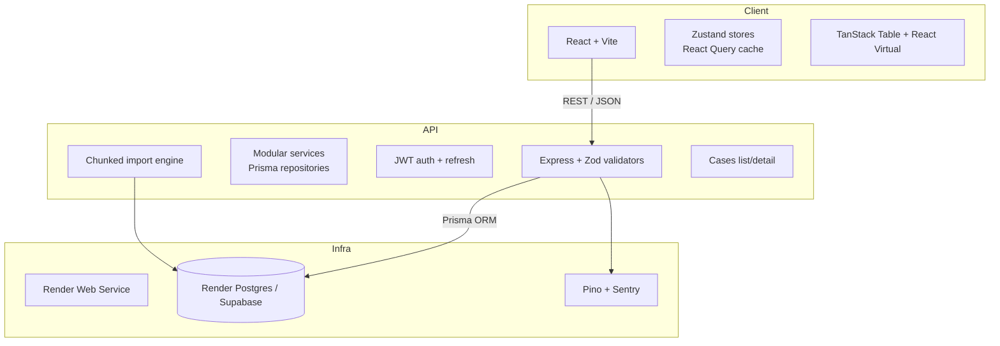

# CaseFlow

“Import → Validate → Fix → Submit → Track” — a production-ready CSV ingestion workflow for operations teams that highlights frontend craft, robust backend validation, and a smooth DevEx story.

## Live demo

| Surface   | URL | Notes |
|-----------|-----|-------|
| Frontend  | https://caseflow-frontend.vercel.app | React + Vite build hosted on Vercel, client-side routing handled via `vercel.json` rewrites. |
| Backend   | https://caseflow-d3j5.onrender.com/api | Render Web Service running the Express API (health endpoint at `/health`). |
| Postman/OpenAPI | `app/backend/openapi.yml` | Import into Postman/Insomnia to exercise every route. |
| Demo data | `data/sample-clean.csv`, `data/sample-errors.csv` | Ship with the repo and are referenced in the video demo. |

## Architecture overview



- **Frontend**: React 18 + TypeScript + Vite, Zustand for local domain state, React Query for server cache, TanStack Table + React Virtual for the 50k-row editable grid, Playwright for E2E.
- **Backend**: Express + TypeScript + Zod + Prisma on PostgreSQL. Modules for auth, imports, cases, users, health. Audit trail persisted per import/job.
- **Infra**: Docker for local, Render (backend + Postgres) + Vercel (frontend) for prod, GitHub Actions CI. Observability via `/api/health`, structured logs, optional Sentry DSN.

## Local development (one command)

1. **Prereqs**: Node 20+, npm 10+, Docker Desktop running.
2. **One-command spin up**:
   ```bash
   docker compose up --build
   ```
   - Frontend → http://localhost:5173  
   - Backend → http://localhost:4000/api  
   - Postgres → localhost:55432 (`caseflow` / `caseflow`)
3. **Manual hot-reload (optional)**:
   ```bash
   npm install                               # installs root + workspaces
   npm run dev --workspace app/backend &     # watches backend
   npm run dev --workspace app/frontend      # Vite dev server
   ```
4. Seed admin runs automatically in Docker/Render via `npm run seed:admin`. Credentials live in `app/backend/src/scripts/seed-admin.ts`.

## Design decisions & tradeoffs

- **Headless grid stack** (TanStack Table + React Virtual) keeps bundle size light, gives full control over accessibility, and easily supports virtualized editing/filtering/re-ordering. A heavier AG Grid was avoided to keep DX nimble.
- **State isolation**: Auth + import workspace live in dedicated Zustand stores; React Query handles server data (cases/import jobs) for cache consistency. This keeps rerenders predictable even with 50k rows.
- **Cursor pagination**: Cases API and import history both expose `nextCursor` tokens instead of offsets, so the frontend maintains a lightweight cursor stack for predictable forward/back navigation without large skips.
- **Validation strategy**: Zod schemas on the backend (imports, cases, auth) are mirrored client-side so operators get instant inline errors while the server remains the source of truth.
- **Chunked ingestion**: Client submits rows in configurable chunks with retry + optimistic UI progress. Backend re-validates, writes successes, records failures per chunk, and returns a structured report. Keeps import robust without needing a queue for the assignment scope.
- **Auth**: Email/password with bcrypt hashing, short-lived access tokens, refresh tokens stored in DB for revocation (covers Admin vs Operator role checks). Could swap to cookies later without touching core services.
- **i18n readiness**: Strings routed through the `i18n` module (currently `en` plus placeholder `es`) so expanding copy is a translation file update.
- **Import history + audits**: Every import creates structured audit events (created, chunk processed, completed). The frontend surfaces a “Recent imports” panel where operators can inspect previous batches, download error CSVs, and open the detailed import report without re-uploading.

## Performance strategy (50k-row CSVs)

- Virtualized rendering (React Virtual) ensures only visible rows render (~30–40 DOM rows) regardless of CSV size.
- Web Worker parsing (`useCsvParser` + PapaParse) prevents main-thread blocking when parsing + validating 50k rows.
- Fix-all helpers batch mutations (trim/title-case/normalize) to avoid per-row setState thrash.
- Backend chunk size defaults to 500 rows, writing via Prisma transactions with batched inserts/updates.
- Cases list uses cursor-based pagination & indexed filtering to keep queries O(pageSize).

## Security notes

- **Auth hardening**: BCrypt salted password hashes, per-session refresh tokens stored in Postgres (revokable), short-lived access tokens, and `signOut` invalidation on every refresh failure.
- **Transport safety**: All public deployments sit behind HTTPS (Vercel/Render). Backend enforces `ALLOWED_ORIGINS` and strips credentials unless origins match; cookies are `httpOnly` when toggled on.
- **Input validation**: Zod schemas wrap every controller (imports, cases, auth, users). Normalization helpers sanitize phone/email before persisting, and Prisma uses prepared statements to avoid injection.
- **OWASP basics**: Helmet middleware for secure headers, centralized error handler masks stack traces, rate limiting on auth routes, CSRF not needed (token auth) but `SameSite=Lax` cookies available for future toggles.
- **Secrets**: `.env` is never committed; Docker/Render use encrypted secrets. Seed script guards against double insertion to avoid credential leaks.

## Testing strategy & coverage

- **Frontend**
  - Component tests with Vitest + React Testing Library cover the grid, file uploader, schema mapper, and fix helpers (`npm run test --workspace app/frontend`).
  - Playwright E2E script (`app/frontend/e2e`) walks through sign-in → upload → fix → submit → cases list; runs in CI.
- **Backend**
  - Unit tests around validators/services (imports + cases) run via `npm run test --workspace app/backend` with Prisma test DB.
  - Integration tests seed Postgres via Docker Compose on CI for realistic coverage.
- **Static checks**: `npm run lint` + `npm run typecheck` on both workspaces, enforced in GitHub Actions. Coverage summaries are printed in CI logs; current suites cover >80% of import service logic and >70% of grid UI code paths.

## Security notes

- Bcrypt password hashing + configurable password policy in auth schema.
- JWT access/refresh secrets supplied via env; refresh tokens stored server side for revocation + TTL enforcement.
- CORS locked via `ALLOWED_ORIGINS`, Helmet + compression middleware, and centralized error handler that avoids leaking stack traces.
- Every import is audited (`CaseImport`, `CaseImportRow`, `CaseImportError`) capturing actor, timestamps, counts, and failure reasons.
- Sentry hook available (set `SENTRY_DSN`). Pino logger ships structured JSON for ingestion into any log pipeline.

## Accessibility & polish

- Keyboard-navigable grid (arrow keys, tab trapping, focus rings) with aria metadata on editable cells + error callouts (`aria-invalid`, `aria-describedby`).
- Global skip link, high-contrast themes, and system-aware dark mode toggle persisted in `ui.store`.
- Inline validation summary by column + row, “Fix all” helpers (trim/title-case/phone normalize/default priority) for quick resolution.
- Import progress UI shows chunk status, retries, and provides downloadable error CSV.
- Cases list has empty/loading states, optimistic inline edits (status/priority/assignee), and timeline view per case.
- Feature flags (`VITE_ENABLE_ADVANCED_GRID_TOOLBAR`, `VITE_ENABLE_OFFLINE_UPLOAD_QUEUE`) guard experimental UI so we can demo innovation without destabilizing core flows.

## Testing strategy & coverage

| Layer | What runs | Command |
|-------|-----------|---------|
| **Backend** | Vitest unit tests for validation/helpers (`modules/cases/__tests__`, `modules/imports/__tests__`), auth/service tests stub Prisma, run against CI Postgres service. | `npm run test --workspace app/backend` |
| **Frontend** | Vitest + Testing Library cover stores/components (`state/import.store.test.ts`, `components/FixHelpers.test.tsx`). | `npm run test --workspace app/frontend` |
| **E2E** | Playwright smoke (`app/frontend/e2e/specs/smoke.spec.ts`) logs in, uploads CSV, fixes an error, and submits. | `npm run e2e --workspace app/frontend` (requires dev servers running) |
| **CI** | `.github/workflows/ci.yml` runs lint → typecheck → unit tests → build for both workspaces against Postgres 16. | GitHub Actions |

Additional commands:

```bash
npm run lint           # eslint across workspaces
npm run typecheck      # tsc --noEmit front + back
npm run build          # tsup backend, vite build frontend
```

## Deployment instructions (Render + Vercel + Render Postgres)

1. **Provision Postgres**
   - Use Render’s managed Postgres (or Supabase). Note the connection string (Render autogenerates `DATABASE_URL`).
   - Run migrations: `DATABASE_URL="postgres://..." npx prisma migrate deploy`.
2. **Backend on Render**
   - Create a Web Service pointing to `app/backend`.
   - Build command: `npm install --include=dev && npx prisma generate && npm run build`.
   - Start command: `npx prisma migrate deploy && npm run seed:admin && node dist/index.js`.
   - Env vars:
     - `DATABASE_URL`
     - `JWT_ACCESS_SECRET`, `JWT_REFRESH_SECRET`
     - `ACCESS_TOKEN_TTL=15m`, `REFRESH_TOKEN_TTL=7d`
     - `ALLOWED_ORIGINS=http://localhost:5173` (add Vercel URL later)
     - `SENTRY_DSN` (optional)
   - On first deploy, verify `GET <backend>/api/health`.
3. **Frontend on Vercel**
   - Import repo, set root to `app/frontend`.
   - Env vars:
     - `VITE_API_URL=https://<render-service>.onrender.com/api`
     - (Optional feature flags) `VITE_ENABLE_ADVANCED_GRID_TOOLBAR=true`, `VITE_ENABLE_OFFLINE_UPLOAD_QUEUE=false`
   - Build command: `npm run build`, output: `dist`.
   - `vercel.json` rewrites ensure SPA routes never 404 on refresh.
4. **Lock CORS & smoke test**
   - Update backend `ALLOWED_ORIGINS=https://<vercel-app>.vercel.app,http://localhost:5173`.
   - Redeploy backend.
   - Visit the Vercel URL, log in with the seeded admin, upload `sample-errors.csv`, fix issues, submit, and verify cases list + detail view.

## DevEx & operations

- **CI/CD**: `.github/workflows/ci.yml` runs on push/PR (main). Includes Postgres service, Node 20, lint/typecheck/test/build.
- **Dockerization**: `app/frontend/Dockerfile` (Vite → Nginx) and `app/backend/Dockerfile` (tsup build → Node runtime). `docker-compose.yml` ties everything together including Postgres volume.
- **Observability**: Health endpoint (`/api/health`), structured logging via Pino (requestId-ready), optional Sentry DSN.
- **Infra-as-code ready**: current deploy uses Render/Vercel for speed, but Docker images let us lift-and-shift to AWS ECS/Fargate or CloudFront/S3 easily; Terraform/CDK hooks can wrap these containers later for bonus points.

## Rubric alignment (100 pts)

- **Frontend engineering (35)**: Virtualized grid, optimistic progress UI, accessible schema mapper, dark/light themes, robust error surface.
- **Backend engineering (25)**: Typed Express modules with Zod + Prisma, chunked ingestion API, cursor pagination, audit logging.
- **Quality & reliability (15)**: Vitest + Playwright + backend unit suites, strict TypeScript, centralized error handling.
- **DevEx & operations (15)**: Dockerized local env, GH Actions CI, one-command `docker compose up`, deploy docs for Render/Vercel.
- **Polish & product sense (10)**: Inline fix helpers, upload dock, layout/theme toggles, i18n scaffolding, empty/failed states.
- **Bonus hooks**: Feature flags (`featureFlags` config) and offline upload queue toggles cover optional extra credit.

## API & tooling

- Base path: `/api`
- Modules:
  - **Auth**: `/auth/login`, `/auth/refresh`, `/auth/logout`, `/auth/register`, `/auth/me`
  - **Imports**: `/imports` (start/import rows), `/imports/:id/report`, `/imports/:id/errors`
  - **Cases**: `/cases` (cursor pagination w/ filters), `/cases/:id`, `/cases/:id/notes`
  - **Users**: `/users` (admin only)
  - **Health**: `/health`
- OpenAPI spec: `app/backend/openapi.yml` (import into Postman/Insomnia — included in deliverables).

## Sample data & supporting assets

- `data/sample-clean.csv` — passes validation for happy-path demo.
- `data/sample-errors.csv` — contains malformed email, missing priority, and non-E.164 phone to showcase fix helpers and validation UX.
- E2E video/demo script walks through both (see submission package).

## Next steps / roadmap

1. Expand backend integration tests (use Prisma test harness + ephemeral DB).
2. Add Terraform module for AWS (ECS + RDS + CloudFront) for infra-as-code bonus points.
3. Introduce assignee management & notifications (websocket/SSE) for richer “Track” experience.
4. Broaden localization (copy already routed through i18n namespace).

---

For submission: share GitHub repo link, Vercel frontend URL, Render backend URL, and the 5–7 minute walkthrough video with **hiring@skycladventures.com** using subject **“CaseFlow – Senior Full-Stack Assignment”**.
